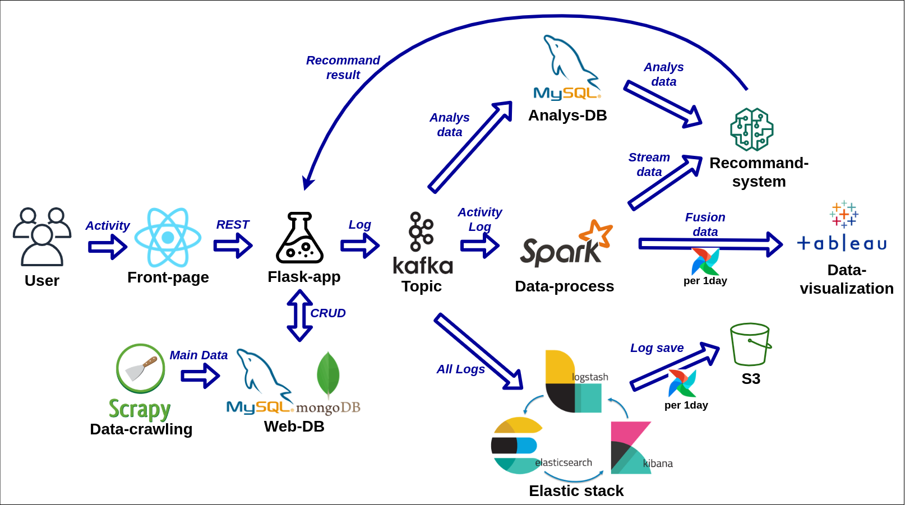
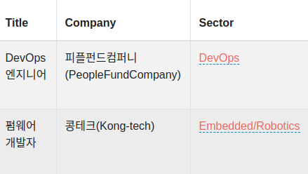

# WhyDoThat 프로젝트 github페이지로 이동하는 Readme 입니다.
## 데이터 파이프라인 참조 이미지

## Career-scrapy-schduler
* [Github Repogitory Link](https://github.com/WhyDoThat-career/career-scrapy-schduler)
* Scrapy로 동작하는 크롤러 저장소
* 주요 동작 : 데이터 수집 및 직군 분류
* 

## Career-flask-server
* [Github Repogitory Link](https://github.com/WhyDoThat-career/career-flask-server)
* Flask로 동작하는 백엔드 저장소
* 주요 동작 : API 제공, 백엔드 서비스

## Nginx-setting
* [Github Repogitory Link](https://github.com/WhyDoThat-career/nginx-setting)
* Nginx 셋팅 구조 저장소
* 주요 동작 : 배포 환경을 위한 셋팅 관리

## Data-center
* [Github Repogitory Link](https://github.com/WhyDoThat-career/Data-center)
* 분석을 위한 Data 관리를 위한 저장소
* 주요 동작 : 데이터베이스 서비스 및 관리 UI
**Kafka-mysql-consumer**
 * [Github Repogitory Link](https://github.com/WhyDoThat-career/Kafka-mysql-consumer)
 * WEB LOG중 특정로그를 선별해서 Mysql로 적재

## Kafka-server
* [Github Repogitory Link](https://github.com/WhyDoThat-career/Kafka-server)
* Zookeeper 및 Kafka 서버 환경 관리
* 주요 동작 : Stream 동작에서 브로커 역할

## Elastic-stack-docker
* [Github Repogitory Link](https://github.com/WhyDoThat-career/Elastic-stack-docker)
* ELK 스택 환경 관리를 위한 저장소
* 주요 동작 : WEB LOG 저장, 검색엔진

## Spark-server
* [Github Repogitory Link](https://github.com/WhyDoThat-career/Spark-server)
* Spark 환경에서의 데이터 분석 및 추천 코드 저장소
  * 현재 운영 서버에서는 Pandas-server로 대체
* 주요 동작 : 데이터 분석 및 추천 생성

## Pandas-server
* [Github Repogitory Link](https://github.com/WhyDoThat-career/Pandas-server)
* 리소스의 한계로 인한 Spark-server와 같은 동작을 하는 Pandas로 구현된 서버 코드 저장소
* 주요 동작 : 데이터 분석 및 추천 생성
